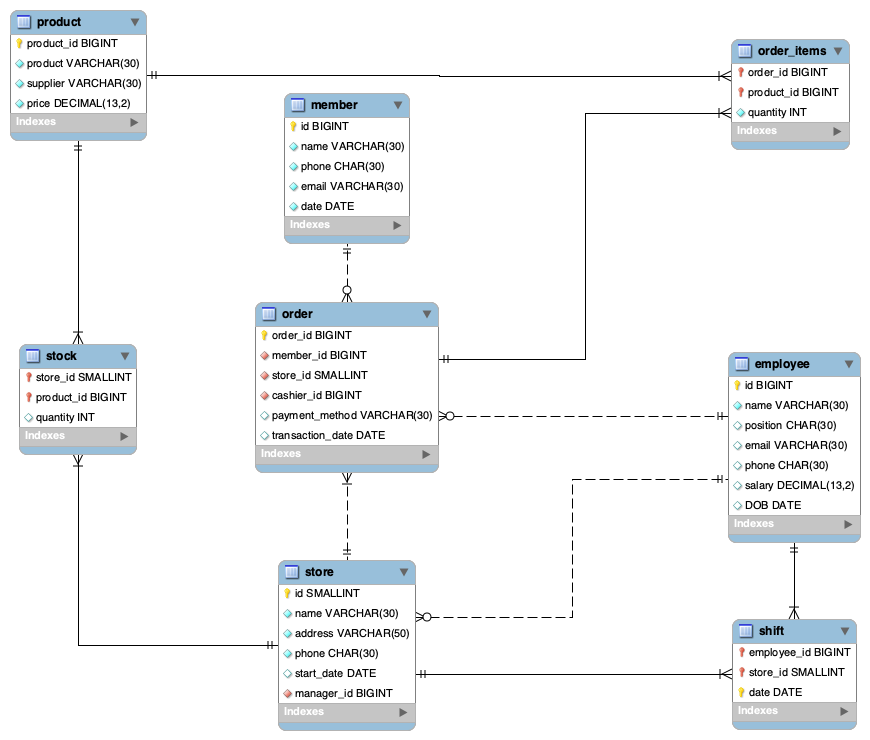

# CIS 451/551 Final Project 
**Winter 2023**

Name: Ruimin Zhang

Project title: Asian Market Database Design

**Connection information**
- port number: 3398
- hostname: ix.cs.uoregon.edu
- guest account login/password: guest/guest
- database name: **market**
- project URL: 
- highlights: 

## 2. Summary
This project is intended to design a database for a local Asian market in Eugene, OR. 
The project involves creating a structured and efficient system to manage stores, inventory, 
sales, employees, and customer data.

To create an effective database for a local Asian market, a stock table to track inventory,
an order table to record transactions, an order_items table to record each product within an order,
a member table to manage customer information, a table for tracking employee information, 
a store table to keep track of existing registered stores, and a shift table to manage employees shifts at stores are required. 

By implementing a well-designed database system, the local Asian market can improve its operations and better
serve its customers.

## 3. Logical Design - ER Diagram

## 4. Physical Design
### Tables:
- employee
- member
- product
- log_in (depends on employee)
- store (depends on employee)
- stock (depends on store, product)
- order (depends on store, member, employee)
- order_items (depends on order, product)

## 5. List of Applications
[//]: # (Once the user logged in, log_in table will update `status` and `last_log_in` for that user.)
Basic:
- Query: the website allows users to interact and query through the database to fetch data
- Insert: users may insert values to the table by interactively selecting desired values
- Update/Delete: if the changed rows affect content in other tables, the content in the dependent tables will also be updated

Insert/Delete:
- create/delete new employee/member/order/product
- create/delete employee will update employee and shift
- create/delete an order will update both order and order_items
- create/delete a product will update both product and stock

Update:
- update stock by changing the quantity of the product
- update the shift of an employee

Query:
- summarize stock of the day and highlight items that needs refill
- find a specific order with order details including total price and customer information
- find active/inactive customers 
  - `active customer` is defined as one who completed more than 5 orders within the last 6 months
  - `inactive customer` is defined as one who has not ordered for the past 6 months
- find top n popular products

## 6. User's Guide

On the homepage, the user is prompted to choose a store or create a new store. If a new store is created, the user will be redirected to the homepage.

Once they choose a store, charts of active/inactive users, low stock information, top 5 popular products will be displayed. 
If click on manage data, they will be redirected to another page where the user is able to select action (view, insert, update, or delete) and a table name to process.
Within view, all tables can be chosen. Various options will be provided including where clause and order clause. After information is filled, the output will be displayed.
Within insert, tables include employee, member, shift, order, product can be chosen. The user will input information of one row.
Within delete, all tables can be selected. The user will select one unique identifier of the table to delete.
Within update, all tables can be selected. The user is able to update the table once filled in desired information.

## 7. Contents of tables
Initialization of the database is included in directory **[sql](sql/)**

To ensure data validation, some data are generated by random from join relationships of the existing table.

## 8. Implementation code
Webpage design code is included in directory **[website](website/)**# AsianMarketDatabase
